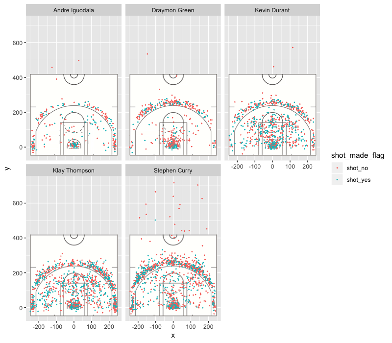

Workout01-michael-xu
================
Michael Xu
3/12/2019

### Including packages

``` r
library(dplyr)
```

    ## Warning: package 'dplyr' was built under R version 3.5.2

    ## 
    ## Attaching package: 'dplyr'

    ## The following objects are masked from 'package:stats':
    ## 
    ##     filter, lag

    ## The following objects are masked from 'package:base':
    ## 
    ##     intersect, setdiff, setequal, union

``` r
library(ggplot2)
```

Effective Shooting Percentage
=============================

``` r
gsw <- read.table("../data/shots-data.csv", header=TRUE, sep=",")
# group_by(gsw, name, sum(shot_made_flag))

summarise(group_by(gsw, name), Total_2pt_Field_Goal = sum(shot_type == "2PT Field Goal"), made = sum(shot_made_flag[shot_type == "2PT Field Goal"] == "shot_yes"), perc_made = made/Total_2pt_Field_Goal)
```

    ## # A tibble: 5 x 4
    ##   name           Total_2pt_Field_Goal  made perc_made
    ##   <fct>                         <int> <int>     <dbl>
    ## 1 Andre Iguodala                  210   134     0.638
    ## 2 Draymon Green                   346   171     0.494
    ## 3 Kevin Durant                    643   390     0.607
    ## 4 Klay Thompson                   640   329     0.514
    ## 5 Stephen Curry                   563   304     0.540

``` r
summarise(group_by(gsw, name), Total_3pt_Field_Goal = sum(shot_type == "3PT Field Goal"), made = sum(shot_made_flag[shot_type == "3PT Field Goal"] == "shot_yes"), perc_made = made/Total_3pt_Field_Goal)
```

    ## # A tibble: 5 x 4
    ##   name           Total_3pt_Field_Goal  made perc_made
    ##   <fct>                         <int> <int>     <dbl>
    ## 1 Andre Iguodala                  161    58     0.360
    ## 2 Draymon Green                   232    74     0.319
    ## 3 Kevin Durant                    272   105     0.386
    ## 4 Klay Thompson                   580   246     0.424
    ## 5 Stephen Curry                   687   280     0.408

``` r
summarise(group_by(gsw, name), Total_Shots = length(shot_made_flag), made = sum(shot_made_flag == "shot_yes"), perc_made = made/Total_Shots)
```

    ## # A tibble: 5 x 4
    ##   name           Total_Shots  made perc_made
    ##   <fct>                <int> <int>     <dbl>
    ## 1 Andre Iguodala         371   192     0.518
    ## 2 Draymon Green          578   245     0.424
    ## 3 Kevin Durant           915   495     0.541
    ## 4 Klay Thompson         1220   575     0.471
    ## 5 Stephen Curry         1250   584     0.467

Report
======

The Golden State Warriors have been dominating the National Basketball Association (NBA) in the recent years. The team has many big name players like Kevin Durant, Stephan Curry, Andre Iguodala, Klay Thompson, Draymond Green, and Stephen Curry. It is hard to find the most efficient player with a team this talented. In the 2015-2016 season Stephen Curry was named the Most Valuable Player (MVP) for the season, and in the 2016-2017 Kevin Durant was named MVP for the final. In the 2016 season who do we think was the efficient player? Was it Kevin Durant, Stephen Curry, or maybe another player that has been overshadowed?

``` r
summarise(group_by(gsw, team_name), Total_2pt_Field_Goal = sum(shot_type == "2PT Field Goal"), made = sum(shot_made_flag[shot_type == "2PT Field Goal"] == "shot_yes"), perc_made = made/Total_2pt_Field_Goal)
```

    ## # A tibble: 1 x 4
    ##   team_name             Total_2pt_Field_Goal  made perc_made
    ##   <fct>                                <int> <int>     <dbl>
    ## 1 Golden State Warriors                 2402  1328     0.553

``` r
summarise(group_by(gsw, team_name), Total_3pt_Field_Goal = sum(shot_type == "3PT Field Goal"), made = sum(shot_made_flag[shot_type == "3PT Field Goal"] == "shot_yes"), perc_made = made/Total_3pt_Field_Goal)
```

    ## # A tibble: 1 x 4
    ##   team_name             Total_3pt_Field_Goal  made perc_made
    ##   <fct>                                <int> <int>     <dbl>
    ## 1 Golden State Warriors                 1932   763     0.395

``` r
summarise(group_by(gsw, team_name), Total_Shots = length(shot_made_flag), made = sum(shot_made_flag == "shot_yes"), perc_made = made/Total_Shots)
```

    ## # A tibble: 1 x 4
    ##   team_name             Total_Shots  made perc_made
    ##   <fct>                       <int> <int>     <dbl>
    ## 1 Golden State Warriors        4334  2091     0.482

From the statistics we can clearly see that these 5 players combined had a total of 4334 shots. They made a staggering 2091 for percent of 48.2% success rate. Let us break this down a bit more and look at their total 2pt and 3pt attempt. We can see that they attempted a total of 2402 2pt and made 1328 of them leading them to a 55.3% success rate for their 2 pts. By looking at the 3 pts we can see that there is about 500 shots less attempted than the 2pts. There was 1932 3pts attempted with 763 success for a 39.5% rate.



We will break down the five starting players to see if there is a single indivdual that stands out offensively. From the photo above we can clearly see that Stephen Curry and Klay Thompson have the most shots around the 3 point line. We can also see that Andre Iguodala seems to have attemped the least amount of shots.

``` r
gsw <- read.table("../data/shots-data.csv", header=TRUE, sep=",")
# group_by(gsw, name, sum(shot_made_flag))

summarise(group_by(gsw, name), Total_2pt_Field_Goal = sum(shot_type == "2PT Field Goal"), made = sum(shot_made_flag[shot_type == "2PT Field Goal"] == "shot_yes"), perc_made = made/Total_2pt_Field_Goal)
```

    ## # A tibble: 5 x 4
    ##   name           Total_2pt_Field_Goal  made perc_made
    ##   <fct>                         <int> <int>     <dbl>
    ## 1 Andre Iguodala                  210   134     0.638
    ## 2 Draymon Green                   346   171     0.494
    ## 3 Kevin Durant                    643   390     0.607
    ## 4 Klay Thompson                   640   329     0.514
    ## 5 Stephen Curry                   563   304     0.540

``` r
summarise(group_by(gsw, name), Total_3pt_Field_Goal = sum(shot_type == "3PT Field Goal"), made = sum(shot_made_flag[shot_type == "3PT Field Goal"] == "shot_yes"), perc_made = made/Total_3pt_Field_Goal)
```

    ## # A tibble: 5 x 4
    ##   name           Total_3pt_Field_Goal  made perc_made
    ##   <fct>                         <int> <int>     <dbl>
    ## 1 Andre Iguodala                  161    58     0.360
    ## 2 Draymon Green                   232    74     0.319
    ## 3 Kevin Durant                    272   105     0.386
    ## 4 Klay Thompson                   580   246     0.424
    ## 5 Stephen Curry                   687   280     0.408

``` r
summarise(group_by(gsw, name), Total_Shots = length(shot_made_flag), made = sum(shot_made_flag == "shot_yes"), perc_made = made/Total_Shots)
```

    ## # A tibble: 5 x 4
    ##   name           Total_Shots  made perc_made
    ##   <fct>                <int> <int>     <dbl>
    ## 1 Andre Iguodala         371   192     0.518
    ## 2 Draymon Green          578   245     0.424
    ## 3 Kevin Durant           915   495     0.541
    ## 4 Klay Thompson         1220   575     0.471
    ## 5 Stephen Curry         1250   584     0.467

``` r
summarise(group_by(gsw, team_name), Total_Shots = length(shot_made_flag), made = sum(shot_made_flag == "shot_yes"), perc_made = made/Total_Shots)
```

    ## # A tibble: 1 x 4
    ##   team_name             Total_Shots  made perc_made
    ##   <fct>                       <int> <int>     <dbl>
    ## 1 Golden State Warriors        4334  2091     0.482

<p>
The statistics are in Kevin Durant leads the the total percent made (54.1%), followed by Andre Iguodala (51.8%), Klay Thompson (47.1%), Stephen Curry (46.7), and Draymon Green (42.4%). Only Kevin Durant and Andre Igudala did better than the 5 Golden State Warriors average percent of (48.2%). However there's a lot more information to be uncovered if we dive a little but deeper.
</p>
<p>
Lets first break down the 2 pointers. Andre Iguodala made a shocking 63.8% of all his 2pts, however he only attemped 210 shots. To put that into perspective, that is less than 1/3 of what Kevin Durant and Klay Thompson attempted. The next shooter is Kevin Durant (60.7%), Stephen Curry (54.0%), Klay Thompson (51.4%), and Drayon Green(49.4%). Once again both Andre Inguodala and Kevin Durant do better than the average of 55.3%.
</p>
<p>
Now lets break down the 3 pointers. Klay Thompson falls in the front with 42.4% followed by Stephen Curry (40.8%), Kevin Durant (38.6%), Andre Iguodala (36.0%), and Draymon Green (31.9%). There is a change on who does better than average this time. Klay Thompson and Stephen Curry beat the percentage of 39.5%.
</p>
<p>
We can also break down efficiency by calculating average points score per shot attempted
</p>
``` r
summarise(group_by(gsw, team_name), Total_Shots = length(shot_made_flag), Total_Points_Made =
sum(shot_made_flag[shot_type == "3PT Field Goal"] == "shot_yes") * 3 + sum(shot_made_flag[shot_type == "2PT Field Goal"] == "shot_yes") * 2, Points_per_Shot = Total_Points_Made/Total_Shots)
```

    ## # A tibble: 1 x 4
    ##   team_name             Total_Shots Total_Points_Made Points_per_Shot
    ##   <fct>                       <int>             <dbl>           <dbl>
    ## 1 Golden State Warriors        4334              4945            1.14

``` r
summarise(group_by(gsw, name), Total_Shots = length(shot_made_flag), Total_Points_Made =
sum(shot_made_flag[shot_type == "3PT Field Goal"] == "shot_yes") * 3 + sum(shot_made_flag[shot_type == "2PT Field Goal"] == "shot_yes") * 2, Points_per_Shot = Total_Points_Made/Total_Shots)
```

    ## # A tibble: 5 x 4
    ##   name           Total_Shots Total_Points_Made Points_per_Shot
    ##   <fct>                <int>             <dbl>           <dbl>
    ## 1 Andre Iguodala         371               442           1.19 
    ## 2 Draymon Green          578               564           0.976
    ## 3 Kevin Durant           915              1095           1.20 
    ## 4 Klay Thompson         1220              1396           1.14 
    ## 5 Stephen Curry         1250              1448           1.16

<p>
If we look at thigs from this perspective than we can see that Points\_per\_Shot of the 5 players we can see that they're all relatively close together. Kevin Durant leads with (1.2 points/shot), then Andre Iguodala (1.19 points/shot), Stephen Curry (1.16 points/shot), Klay Thompson (1.14 points/shot), and lastly Draymon Green (.976 points/shot). Only Kevin Durant, Andre Iguodala, and Stephen Curry have a better point/shot above average of (1.14)
</p>
<p>
The thing to take away is that these five players have been outstanding, and great in their own way. If you want the player with the best 2 pt percent go for Andre Igudala. If you want the best 3 pt percent player go for Klay Thompson. If you want the best overall scoring percent go for Kevin Durant. If you want the player that made the most points go for Stephen Curry. The only player that stands out is Draymon Green, but not in a good way. In terms of scoring he has the lowest percent of making the basket accross all fields. He also has the second lowest attempts and second lowest made baskets accross all fields. To find the most efficent player one would have to define what they consider to be efficent.
